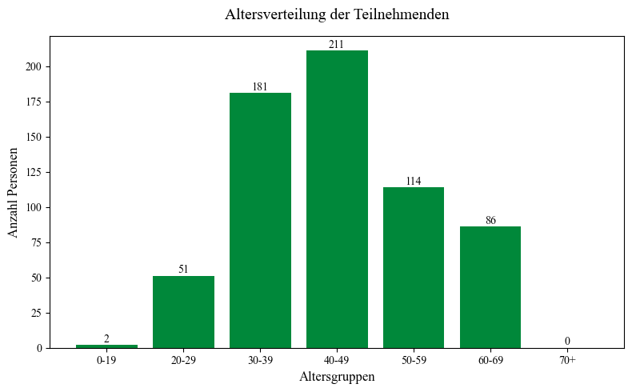

# Wenn Worte Brücken bauen
## Kommunikationsstile von Chatbots und die Effekte auf Reaktanz und affektive Polarisierung

<table>
<tr>
<td>


</td>
<td>

Dieses Repository enthält die Analysen unseres Forschungsprojekts, das im Rahmen des Masterprojekts "KI & politische Diskurse: Kann man LLMS nutzen, um Probleme politischer Diskurse zu lösen?" am Institut für Kommunikationswissenschaft und Medienforschung (IfKW) der LMU München durchgeführt wurde. Wir untersuchen, ob LLM-basierte Chatbots als "Brückenbauer" in politisch aufgeladenen Debatten fungieren können.


</td>
<td>


</td>
</tr>
</table>

## 🎯 Forschungsgegenstand
In einem Online-Experiment (N = 645) wurde unterscuht, wie verschiedene **Kommunikationsstile (empathisch, faktenbasiert, gemischt)** von Chatbots psychologische Abwehrreaktionen (Reaktanz) und die affektive Polarisierung in der Migrationsdebatte beeinflussen. 

### Zentrale Konstrukte & Theorie: 

- **Affektive Polarisierung**: Wachsende Kluft zwischen gesellschaftlichen Gruppen, die sich durch gegenseitige Ablehnung, Misstrauen und Animositäten gegenüber anderen politischen Akteuren (**Soziale Identitätstheorie (SIT)** nach Tajfel und Turner (1979)).

- **Psychologische Reaktanz**: Abwhrreaktion (Backfire-Effekt) bei empfundener Freiheitseinschränkung der eigenen Meinung (Literatur).

- **Wahrgenommene Authentizität und Vertrauen in den Chatbot**: Zentrale Faktoren in der Mensch-KI-Interaktion, die bestimmen, ob Nutzer:innen Informationen akzeptieren oder defensiv reagieren. Vertrauen basiert auf der Erwartung, dass sich das System gemäß sozialer Normen vorhersehbar verhält (**CASA-Paradigma & Anthropomorphismus, Stereotype Content Model**).

<p align="center">
  
</p>

## Forschungsleitendes Modell

<p align="center">
  
</p>

---


## 📊 Methodik & Stichprobe
Die Datenerhebung erfolgte im September 2025 via Payback-Panel.

-  **Design**: Einfaktoirelles Between-Subject-Design (empathisch vs. faktenbasiert vs. gemischt).
- **Setting**: Cross-Cutting-Exposure (Chatbot vetritt konsequent die Gegenposition der Teilnehmer:innen)-
- **Stichprobe** (N = 645)
- 🌍 **Zielgruppe:** Personen aus Deutschland (18-59 Jahre) mit Fokus auf höähere Bildung.  
- 👥 **Stichprobengröße:** 834 Befragte (bereinigt: N = 645)  

### Stichprobenbeschreibung (N = 645)
- **Politische Einstellung**: Die Befragten ordnen sich im Mittel der politischen Mitte zu (M= 6.06 auf einer 11er-Skala), wobei Männer signifikant weiter rechts stehen als Frauen.
- **Einstellung zu Migration**: 276 Teilnehmende befürworten klar eine Obergrenze für Asylbewerber. Es zeigt sich ein schwacher Zusammenhang zwischen Alter und Einstellung: Ältere Personen lehnen Obergrenzen eher ab, ordnen sich aber gleichzeitig eher dem rechten Spektrum zu. 

<br>

| Abschluss | Relative Häufigkeit (%) |
|---|---:|
| mittlere Reife, Realschulabschluss bzw. Polytechnische Oberschule mit Abschluss 10. Klasse | 50.1 |
| abgeschlossenes Hochschulstudium (Uni/FH) | 27.0 |
| Abitur bzw. Erweiterte Oberschule mit Abschluss 12. Klasse (Hochschulreife) | 13.6 |
| Fachhochschulreife (Abschluss einer Fachoberschule etc.) | 9.3 |

<br><br>
  
<p align="center">
  
</p>


### Zentraler Interaktionseffekt

Ein signifikanter Interaktionseffekt (F(2,639) = 5.05,p = 0.007) zeigte, dass die Wahrnehmung des empathischen Kommunikationsstils stark von der Meinungsextremität abhängt:

-  Bei moderater Meinung wurde der empathische KS signifikant stärker als empathisch wahrgenommen (M = 4.57) als bei extremer Meinung (M = 2.96).
- Aufgrund dieser differentiellen Wahrnehmung wurden die Hauptanalysen zur Beantwortung der Forschungsfragen ausschließlich mit den moderaten Fällen (n = 324) durchgeführt, um konfundierende Effekte zu vermeiden.

<p align="center">
  
</p>


## 💡 Wesentliche Erkenntnisse

### Hypothese 1: Einfluss des Kommunikationsstils auf die affektive Polarisierung
Wir untersuchten, ob ein faktenbasierter Chatbot-Stil die Polarisierung verstärkt (H1a) und ob eine Mischform diese reduziert (H1b).
- **Kein signifikanter Haupteffekt:** Der Kommunikationsstil allein führte nicht zu einer statistisch belastbaren Veränderung der affektiven Polarisierung.

- **Deskriptive Trends:** Teilnehmer:innen in der empathischen Bedingung zeigten zwar tendenziell die niedrigsten Polarisierungswerte, während der gemischte und faktenbasierte Stil leicht höhere Werte auslösten - diese Unterschiede blieben jedoch im Bereich des Zufalls.

- **Fazit zu H1:** Weder H1a noch H1b konnten bestätigt werden. Der direkte Weg vom Kommunikationsstil zur affektiven Polarisierung ist somit nicht signifikant, was die Relevanz der nachfolgenden Mediationsanalyse (über Reaktanz) unterstreicht.


### Hypothese 2: Vertrauen als Schlüssel zur Reaktanzminderung
In diesem Analyseschritt untersuchten wir den Zusammenhang zwischen dem Vertrauen in den Chatbot (inkl. wahrgenommene Authentizität) und der ausgelösten psychologischen Reaktanz.
- **Starker negativer Zusammenhang:** Es zeigt sich eine hochsignifikante Korrelation nach Pearson (r= −.71), was bedeutet: Je vertrauenswürdiger und authentischer der Chatbot wahrgenommen wird, desto geringer fällt die Reaktanz der Nutzer:innen aus.

- **Hohe Varianzaufklärung:** Das Vertrauen fungiert als exzellenter Prädiktor und kann etwa 50 % der Varianz der gesamten Reaktanz erklären (R^2 = .50).

- **Einfluss auf alle drei Reaktanzdimensionen:** Die Regressionsanalyse bestätigt, dass Vertrauen alle drei Reaktanzdimensionen (kognitiv, affektiv und Freiheitseinschränkung) signifikant senkt, wobei der Effekt auf die kognitive Reaktanz am stärksten ausgeprägt ist (R^2 = .57).

- **Robustheit des Effekts:** Im Gegensatz zu anderen Hypothesen ist dieser Effekt universell - er zeigt sich in der gesamten Stichprobe (N = 645) unabhängig davon, ob der Chatbot eine moderate oder extreme politische Meinung vertritt.

- **Fazit zu H2:** Die Hypothese wurde vollständig bestätigt. Vertrauen und die wahrgenommene Authentizität sind entscheidende Faktoren, um psychologische Reaktanz in der Mensch-KI-Interaktion zu minimieren.

### Hypothese 3: Reaktanz als psychologischer Vermittler (Mediation)
In der Mediationsanalyse prüften wir, ob der Kommunikationsstil des Chatbots nicht direkt, sondern über das Auslösen von Reaktanz die affektive Polarisierung beeinflusst.

- **Bestätigung der Mediation (H3a):** Für den faktenbasierten Kommunikationsstil konnte eine vollständige Mediation nachgewiesen werden. Das bedeutet: Der Stil führt zu erhöhter Reaktanz (β = 0.34, p < .01), welche wiederum die affektive Polarisierung signifikant verstärkt (β = 0.72, p < .001).

- **Vollständige Mediation:** Besonders bemerkenswert ist, dass der direkte Einfluss des faktenbasierten Stils auf die Polarisierung vollständig verschwand, sobald die Reaktanz als Vermittler berücksichtigt wurde (β = −0.004,p = .992). Die psychologische Abwehrreaktion ist somit der entscheidende Treiber für den Backfire-Effekt.

- **Indirekter Effekt:** Der statistisch signifikante indirekte Effekt des faktenbasierten Stils liegt bei 0.25 (95%-KI [0.052,0.496]).

- **Gemischter Stil (H3b):** Für den gemischten KS konnte keine signifikante Mediation bestätigt werden. Er unterschied sich in seiner Wirkung auf die Reaktanz nicht signifikant vom empathischen Basis-Stil (β = 0.16,p = .208), weshalb H3b verworfen werden musste.

- **Hohe Erklärungskraft:** Das Gesamtmodell für den ersten Pfad (Wirkung auf Reaktanz) erklärt beachtliche 45.5% der Varianz (R^2 = 0.455).

### Forschungsfrage 1: Differenzierte Betrachtung der Reaktanzdimensionen
Zusätzlich zur Gesamtreaktanz untersuchten wir mittels einer multivariaten Varianzanalyse (MANOVA), wie der Kommunikationsstil die drei spezifischen Dimensionen der Reaktanz – *kognitiv, affektiv und Freiheitseinschränkung* – beeinflusst.

- **Signifikante Unterschiede über alle Dimensionen:** Die Analyse bestätigt, dass der Kommunikationsstil des Chatbots alle drei Facetten der Reaktanz signifikant beeinflusst (Wilks’ Λ = .95, p < .05).

- **Der faktenbasierte Stil als stärkster Auslöser:** Deskriptiv löste der faktenbasierte KS in allen drei Dimensionen die höchsten Reaktanzwerte aus. Besonders deutlich ist dies bei der kognitiven Reaktanz (M = 4.92), was auf einen starken gedanklichen Widerstand gegen die dargebotenen Argumente hindeutet.

- **Empathie als Schutzfaktor:** Der empathische Kommunikationsstil erzielte durchgehend die niedrigsten Werte. Post-hoc-Tests verdeutlichen, dass sich der faktenbasierte Stil insbesondere vom empathischen Stil signifikant unterscheidet (alle p < .03).

- **Fazit zu F1:** Während der gemischte und empathische Stil emotional ähnlich positiv aufgenommen werden, provoziert der rein faktenbasierte Stil über alle Reaktanzdimensionen hinweg deutlich mehr Abwehrverhalten.

---

## Anforderungen

Alle benötigten Abhängigkeiten können mit folgendem Befehl installiert werden:

```bash
pip install -r requirements.txt
```

---

## Projektstruktur

```
.
├── analysis_ki_demokratie.ipynb    # Statistische Auswertungen
├── README.md                       # Projektbeschreibung & Dokumentation
├── requirements.txt                # Benötigte Python-Pakete (aktuellste Versionen)
├── .gitignore                      
└── figures/                        # Visualisierungen
```

---

# Hinweise

Dieses Projekt ist Teil eines universitären Forschungsprojekts und dient ausschließlich zu Analyse- und Lernzwecken.
