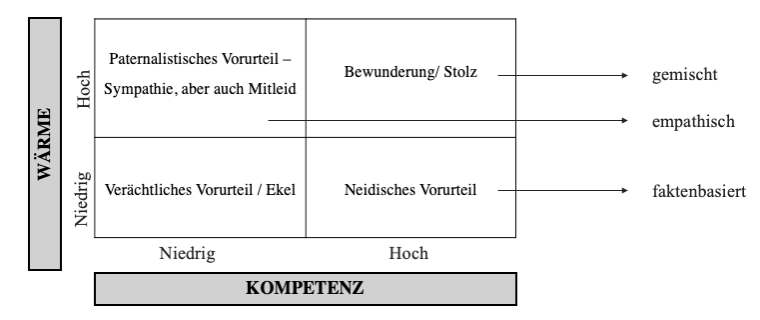
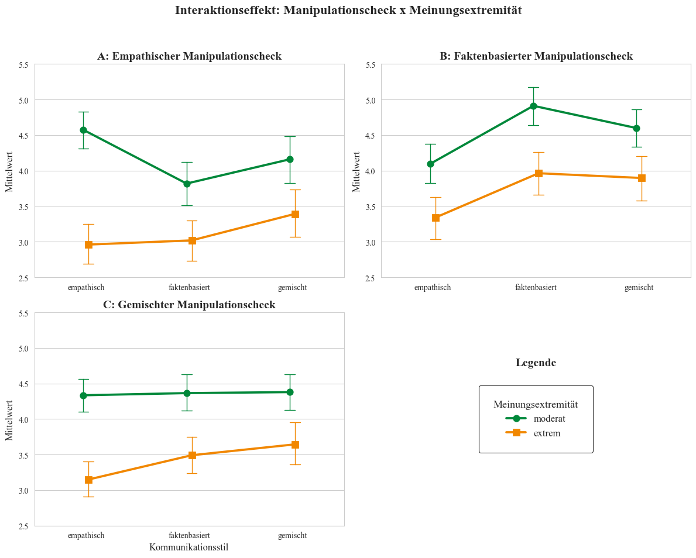

# Wenn Worte Brücken bauen
## Kommunikationsstile von Chatbots und die Effekte auf Reaktanz und affektive Polarisierung

<table>
<tr>
<td>


</td>
<td>

Dieses Repository enthält die Analysen unseres Forschungsprojekts, das im Rahmen des Masterprojekts **KI & politische Diskurse: Kann man LLMs nutzen, um Probleme politischer Diskurse zu lösen?** am Institut für Kommunikationswissenschaft und Medienforschung (IfKW) der LMU München durchgeführt wurde. Angesichts wachsender gesellschaftlicher Spaltung untersuchen wir, ob LLM-basierte Chatbots in hochemotionalen Debatten - wie der über Migration - als digitale "Brückenbauer" fungieren können. Durch gezielte Kommunikationsstile sollen sie psychologische Widerstände abbauen und so einen Beitrag zur Reduktion affektiver Polarisierung leisten. 


</td>
<td>


</td>
</tr>
</table>

## 🎯 Forschungsgegenstand
In einem quantitativen Online-Experiment (*N* = 645) wurde untersucht, wie verschiedene **Kommunikationsstile (empathisch, faktenbasiert, gemischt)** von Chatbots die psychologische Reaktanz und die affektive Polarisierung beeinflussen. 

### Zentrale Konstrukte & Theorie: 

- **Affektive Polarisierung**: Beschreibt die wachsende Kluft zwischen gesellschaftlichen Gruppen, die durch gegenseitige Ablehnung, Misstrauen und Animositäten gegenüber anderen politischen Akteuren geprägt ist. Sie wird maßgeblich durch die Identifikation mit der eigenen Gruppe erklärt (**Soziale Identitätstheorie (SIT)** nach Tajfel und Turner (1979)).

- **Psychologische Reaktanz**: Ein motivationaler Zustand, der auf die Wiederherstellung bedrohter Freiheitsspielräume (wie die eigene Meinung) abzielt. In politischen Diskursen fungiert sie als Mediator für den Backfire-Effekt: Wird ein Gegenstandpunkt als Bedrohung der Autonomie wahrgenommen, verstärkt dies die Polarisierung, statt sie abzubauen.

- **Wahrgenommene Authentizität und Vertrauen in den Chatbot**: Bestimmen, ob Nutzer:innen Informationen akzeptieren oder defensiv reagieren. Vertrauen entsteht, wenn KI-Systeme soziale Heuristiken erfüllen **(CASA-Paradigma)** oder menschliche Eigenschaften zugeschrieben bekommen (**Anthropomorphismus**).

**Stereotype Content Model (Fiske et al., 2007):** 
Einordnung der Kommunikationsstile entlang der Dimensionen Wärme und Kompetenz.

<p align="center">
  
</p>

## Forschungsleitendes Modell

<p align="center">
  
</p>

## Literaturquellen
Fiske, S. T., Cuddy, A. J. C., & Glick, P. (2007). Universal dimensions of social cognition: Warmth and competence. *Trends in Cognitive Sciences*, *11*(2), 77–83. https://doi.org/10.1016/j.tics.2006.11.005  
Tajfel, H., & Turner, J. C. (1979). *An integrative theory of intergroup conflict.*

---

## 📊 Methodik & Stichprobe
Die Datenerhebung erfolgte im November 2025 via Payback-Panel.

-  **Design**: Einfaktorielles Between-Subject-Design (empathisch vs. faktenbasiert vs. gemischt).
- **Setting**: Cross-Cutting-Exposure (Chatbot vetritt konsequent die Gegenposition der Teilnehmer:innen)
- **Stichprobe** (N = 645)
  - Männer: *n* = 326 | Frauen: *n* = 318.
  - **Altersdurchschnitt:** 44.5 Jahre.
  - **Bildung:** Über 50% Realschulabschluss, 27% Hochschulabschluss.
  - **Politische Einstellung**: Die Befragten ordnen sich im Mittel der politischen Mitte zu (*M* = 6.06 auf einer 11er-Skala), wobei Männer signifikant weiter rechts stehen als Frauen.
  - **Einstellung zu Migration**: 42.8% der Teilnehmer:innen befürworten klar eine Obergrenze für Asylbewerber. Es zeigt sich ein schwacher Zusammenhang zwischen Alter und Einstellung: Ältere Personen lehnen Obergrenzen eher ab, ordnen sich aber gleichzeitig eher dem rechten Spektrum zu. 

### Zentraler Interaktionseffekt

Ein signifikanter Interaktionseffekt (*F*(2,639) = 5.05,*p* = 0.007) zeigte, dass die Wahrnehmung des empathischen Kommunikationsstils stark von der Meinungsextremität abhängt:

-  Bei moderater Meinung wurde der empathische KS signifikant stärker als empathisch wahrgenommen (*M* = 4.57) als bei extremer Meinung (*M* = 2.96).
- Aufgrund dieser differentiellen Wahrnehmung wurden die Hauptanalysen zur Beantwortung der Forschungsfragen ausschließlich mit den moderaten Fällen (*n* = 324) durchgeführt, um konfundierende Effekte zu vermeiden.

<p align="center">
  
</p>


## 💡 Wesentliche Erkenntnisse

### Hypothese 1: Kommunikationsstil & Affektive Polarisierung
Wir untersuchten, ob ein faktenbasierter Chatbot-Stil die Polarisierung verstärkt (H1a) und ob eine Mischform diese reduziert (H1b).
- **Ergebnis:** Kein signifikanter direkter Haupteffekt (*F*(2,321)=0.67,*p*=.515).

- **Trends:** Deskriptiv zeigt der empathische Stil die geringsten Polarisierungswerte, die Unterschiede bleiben jedoch statistisch im Zufallsbereich. 

- **Fazit zu H1:** Weder H1a noch H1b konnten bestätigt werden. Der direkte Weg vom Kommunikationsstil zur affektiven Polarisierung ist somit nicht signifikant.


### Hypothese 2: Vertrauen als Schlüssel zur Reaktanzminderung
In diesem Analyseschritt untersuchten wir den Zusammenhang zwischen dem Vertrauen in den Chatbot (inkl. wahrgenommene Authentizität) und der ausgelösten psychologischen Reaktanz.
- **Starker negativer Zusammenhang:** Es zeigt sich eine hochsignifikante Korrelation nach Pearson (r= −.71), was bedeutet: Je vertrauenswürdiger und authentischer der Chatbot wahrgenommen wird, desto geringer fällt die Reaktanz der Nutzer:innen aus.

- **Hohe Varianzaufklärung:** Das Vertrauen fungiert als exzellenter Prädiktor und kann etwa 50 % der Varianz der gesamten Reaktanz erklären (R^2 = .50).

- **Einfluss auf alle drei Reaktanzdimensionen:** Die Regressionsanalyse bestätigt, dass Vertrauen alle drei Reaktanzdimensionen (kognitiv, affektiv und Freiheitseinschränkung) signifikant senkt, wobei der Effekt auf die kognitive Reaktanz am stärksten ausgeprägt ist (R^2 = .57).

- **Robustheit des Effekts:** Im Gegensatz zu anderen Hypothesen ist dieser Effekt universell - er zeigt sich in der gesamten Stichprobe (N = 645) unabhängig davon, ob der Chatbot eine moderate oder extreme politische Meinung vertritt.

- **Fazit zu H2:** Die Hypothese wurde vollständig bestätigt. Vertrauen und die wahrgenommene Authentizität sind entscheidende Faktoren, um psychologische Reaktanz in der Mensch-KI-Interaktion zu minimieren.

### Hypothese 3: Reaktanz als psychologischer Mediator
In der Mediationsanalyse prüften wir, ob der Kommunikationsstil des Chatbots nicht direkt, sondern über das Auslösen von Reaktanz die affektive Polarisierung beeinflusst.

- **Bestätigung der Mediation (H3a):** Für den faktenbasierten Kommunikationsstil konnte eine vollständige Mediation nachgewiesen werden. Das bedeutet: Der Stil führt zu erhöhter Reaktanz (β = 0.34, p < .01), welche wiederum die affektive Polarisierung signifikant verstärkt (β = 0.72, p < .001).

- **Vollständige Mediation:** Besonders bemerkenswert ist, dass der direkte Einfluss des faktenbasierten Stils auf die Polarisierung vollständig verschwand, sobald die Reaktanz als Vermittler berücksichtigt wurde (β = −0.004,p = .992). Die psychologische Abwehrreaktion ist somit der entscheidende Treiber für den Backfire-Effekt.

- **Gemischter Stil (H3b):** Für den gemischten KS konnte keine signifikante Mediation bestätigt werden. Er unterschied sich in seiner Wirkung auf die Reaktanz nicht signifikant vom empathischen Basis-Stil (β = 0.16,p = .208), weshalb H3b verworfen werden musste.


### Forschungsfrage 1: Differenzierte Betrachtung der Reaktanzdimensionen
Zusätzlich zur Gesamtreaktanz untersuchten wir mittels einer multivariaten Varianzanalyse (MANOVA), wie der Kommunikationsstil die drei spezifischen Dimensionen der Reaktanz – *kognitiv, affektiv und Freiheitseinschränkung* – beeinflusst.

- **Signifikante Unterschiede über alle Dimensionen:** Die Analyse bestätigt, dass der Kommunikationsstil des Chatbots alle drei Facetten der Reaktanz signifikant beeinflusst (Wilks’ Λ = .95, p < .05).

- **Der faktenbasierte Stil als stärkster Auslöser:** Deskriptiv löste der faktenbasierte KS in allen drei Dimensionen die höchsten Reaktanzwerte aus. Besonders deutlich ist dies bei der kognitiven Reaktanz (M = 4.92).

- **Empathie als Schutzfaktor:** Der empathische Kommunikationsstil erzielte durchgehend die niedrigsten Werte. Post-hoc-Tests verdeutlichen, dass sich der faktenbasierte Stil insbesondere vom empathischen Stil signifikant unterscheidet (alle p < .03).

- **Fazit zu F1:** Während der gemischte und empathische Stil emotional ähnlich positiv aufgenommen werden, provoziert der rein faktenbasierte Stil über alle Reaktanzdimensionen hinweg deutlich mehr Abwehrverhalten.

---

## Anforderungen

Alle benötigten Abhängigkeiten können mit folgendem Befehl installiert werden:

```bash
pip install -r requirements.txt
```

---

## Projektstruktur

```
.
├── analysis_ki_demokratie.ipynb    # Statistische Auswertungen
├── README.md                       # Projektbeschreibung & Dokumentation
├── requirements.txt                # Benötigte Python-Pakete (aktuellste Versionen)
├── .gitignore                      
└── figures/                        # Visualisierungen
```

---

## Hinweise

Dieses Projekt ist Teil eines universitären Forschungsprojekts und dient ausschließlich zu Analyse- und Lernzwecken.
